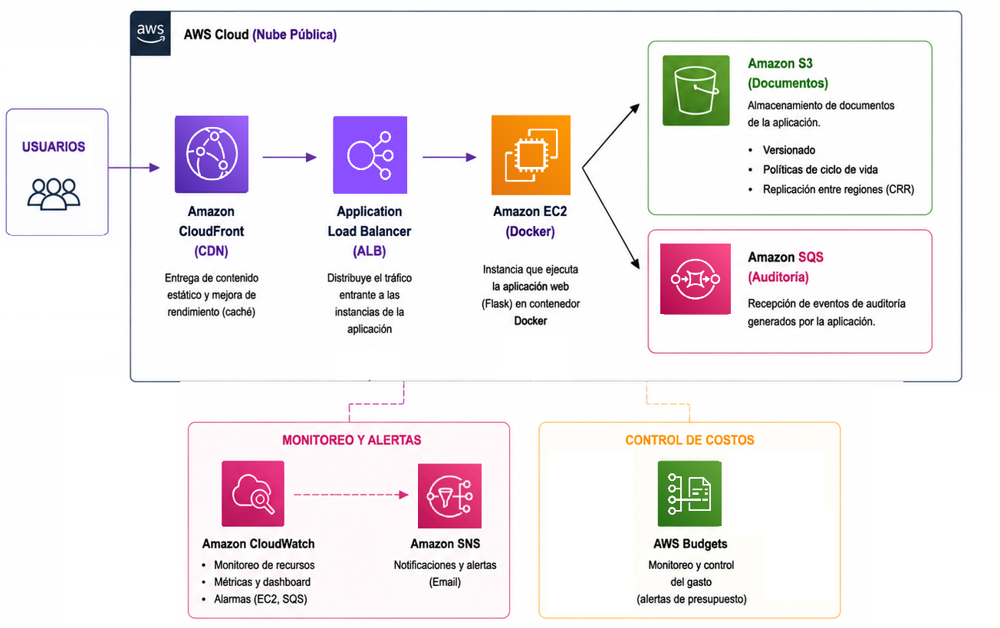
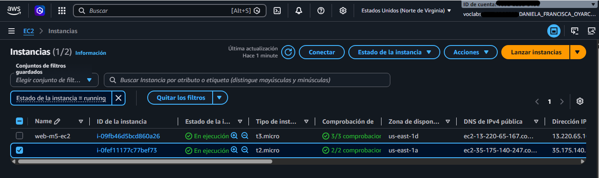
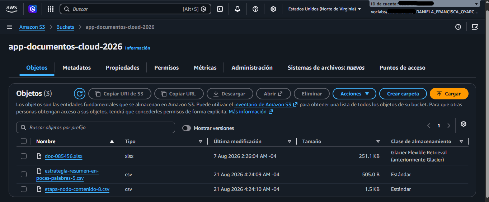
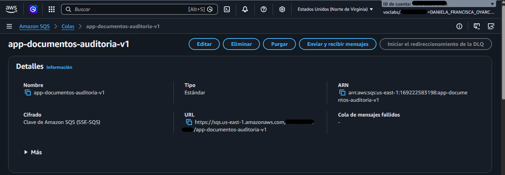
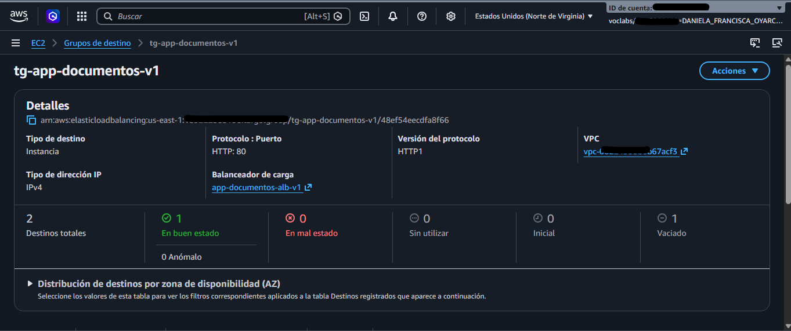
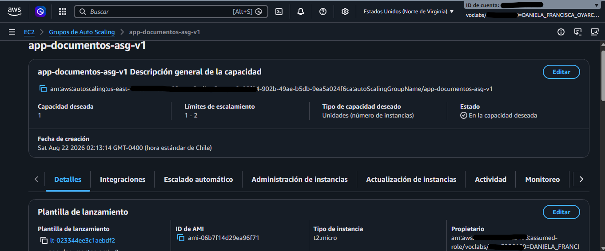
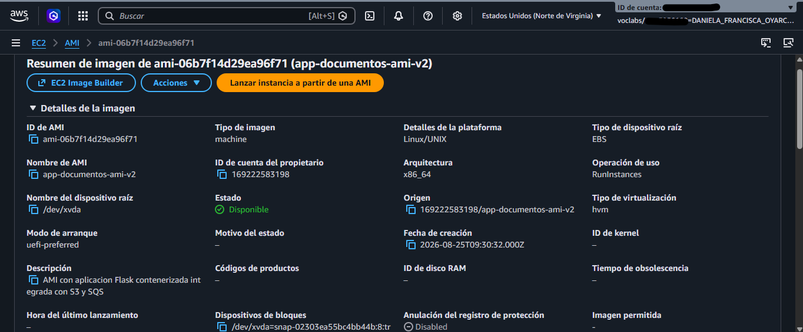
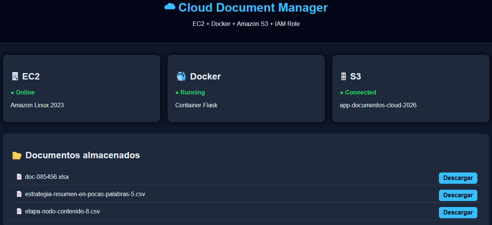

# ☁ Cloud Document Manager AWS

## Aplicación web Flask contenerizada utilizando Amazon EC2, Docker, Amazon S3 y Amazon SQS

Proyecto desarrollado como implementación práctica de arquitectura cloud utilizando servicios de Amazon Web Services (AWS).

La solución implementa una aplicación web que permite consultar documentos almacenados en Amazon S3, generar descargas temporales y registrar eventos de auditoría mediante Amazon SQS.

La aplicación fue desplegada utilizando contenedores Docker sobre Amazon EC2, incorporando escalabilidad mediante Auto Scaling y distribución de tráfico mediante Application Load Balancer.

---

# 🏗️ Arquitectura general implementada

La solución utiliza una arquitectura basada en servicios administrados de AWS:

```
Usuario
   |
   |
Application Load Balancer
   |
   |
Auto Scaling Group
   |
   |
EC2 + Docker
   |
   |
Flask Application
   |
   +----------------+
   |                |
   ↓                ↓
 Amazon S3       Amazon SQS

Documentos       Auditoría
```

## Evidencia de arquitectura




📸 **Captura requerida:**

Crear una imagen propia (puede ser Draw.io, PowerPoint o similar) mostrando:

- Usuario
- ALB
- Auto Scaling
- EC2
- Docker
- Flask
- S3
- SQS

La imagen debe representar el flujo completo de la aplicación.

---

# 🚀 Descripción del proyecto

Cloud Document Manager es una aplicación desarrollada en Python utilizando Flask.

La aplicación permite:

- Visualizar documentos almacenados en Amazon S3.
- Generar enlaces temporales para descarga.
- Registrar acciones realizadas por usuarios.
- Comunicarse con servicios AWS mediante boto3.
- Ejecutarse dentro de un contenedor Docker.

---

# 🖥️ Amazon EC2

La aplicación se ejecuta sobre instancias Amazon EC2 utilizando:

- Amazon Linux 2023.
- Docker Engine.
- IAM Role para acceso seguro a servicios AWS.

## Evidencia EC2 funcionando




📸 **Captura requerida:**

Ingresar por SSH a la instancia y ejecutar:

```bash
docker ps
```

La captura debe mostrar:

- Contenedor activo.
- Nombre del contenedor.
- Puerto publicado:

Ejemplo:

```
0.0.0.0:80->80/tcp
```

---

# 🐳 Contenerización con Docker

La aplicación fue empaquetada mediante Docker utilizando:

- Imagen basada en Python 3.12.
- Flask como framework web.
- Dependencias instaladas mediante requirements.txt.

Construcción:

```bash
docker build -t app-documentos .
```

Ejecución:

```bash
docker run -d -p 80:80 app-documentos
```

---

# 🗄️ Amazon S3

Amazon S3 es utilizado como almacenamiento de documentos.

Bucket utilizado:

```
app-documentos-cloud-2026
```

Funciones implementadas:

- Consulta de archivos disponibles.
- Generación de URLs temporales.
- Descarga segura mediante objetos S3.

## Evidencia Amazon S3




📸 **Captura requerida:**

Desde la consola AWS:

Amazon S3 → Bucket:

```
app-documentos-cloud-2026
```

La captura debe mostrar:

- Nombre del bucket.
- Archivos almacenados dentro.

---

# 📨 Amazon SQS

Amazon SQS es utilizado como sistema de auditoría de eventos.

Cola utilizada:

```
app-documentos-auditoria-v1
```

Eventos registrados:

- Consulta de documentos.
- Descarga de documentos.

Ejemplo:

```json
{
 "evento":"LISTAR_DOCUMENTOS",
 "detalle":"Usuario consultó documentos disponibles"
}
```

## Evidencia Amazon SQS




📸 **Captura requerida:**

Ingresar a:

Amazon SQS → Cola:

```
app-documentos-auditoria-v1
```

Mostrar:

- Mensajes disponibles.
- Fecha de recepción.
- Cantidad de mensajes.

---

# ⚖️ Application Load Balancer

El tráfico hacia la aplicación es distribuido mediante un Application Load Balancer.

Configuración:

- Protocolo: HTTP
- Puerto: 80
- Target Group:

```
tg-app-documentos-v1
```

## Evidencia Load Balancer




📸 **Captura requerida:**

Ir a:

EC2 → Target Groups

Mostrar:

- Nombre del Target Group.
- Instancia registrada.
- Estado healthy.

---

# 🔄 Auto Scaling

La solución utiliza EC2 Auto Scaling para administrar la capacidad de la aplicación.

Configuración:

```
Nombre:

app-documentos-asg-v1
```

Capacidad:

```
Mínimo: 1
Deseado: 1
Máximo: 2
```

## Evidencia Auto Scaling




📸 **Captura requerida:**

Ir a:

EC2 → Auto Scaling Groups

Mostrar:

- Nombre del grupo.
- Capacidad deseada.
- Instancias administradas.

---

# 🖼️ AMI personalizada

Se creó una imagen personalizada para permitir que Auto Scaling pueda crear nuevas instancias con la aplicación configurada.

AMI:

```
app-documentos-ami-v2
```

Incluye:

- Amazon Linux 2023.
- Docker instalado.
- Aplicación Flask.
- Configuración necesaria.

## Evidencia AMI




📸 **Captura requerida:**

Ir a:

EC2 → AMIs

Mostrar:

- Nombre:

```
app-documentos-ami-v2
```

- Estado disponible.
- ID de AMI.

---

# 🌐 Aplicación funcionando

La aplicación permite visualizar los documentos disponibles desde una interfaz web.

## Evidencia aplicación web




📸 **Captura requerida:**

Abrir el DNS del Load Balancer:

Mostrar:

- Página funcionando.
- Nombre del bucket.
- Documentos disponibles.

---

# 🔐 Seguridad implementada

La solución utiliza:

- IAM Role para acceso AWS.
- Security Groups para controlar tráfico.
- SSH mediante llave privada.
- Separación entre aplicación y servicios AWS.

No se almacenan credenciales AWS dentro del código.

---

# 📂 Estructura del proyecto

```
app-documentos/

├── app.py
├── Dockerfile
├── requirements.txt
├── templates/
│   └── index.html
├── images/
│   ├── arquitectura-general.png
│   ├── ec2-docker-running.png
│   ├── s3-documentos.png
│   ├── sqs-auditoria.png
│   ├── alb-target-group.png
│   ├── autoscaling-group.png
│   ├── ami-personalizada.png
│   └── aplicacion-web.png
│
├── README.md
└── .gitignore
```

---

# 🛠️ Tecnologías utilizadas

| Tecnología | Uso |
|---|---|
| Python | Desarrollo aplicación |
| Flask | Framework web |
| Docker | Contenerización |
| Amazon EC2 | Computación |
| Amazon S3 | Almacenamiento |
| Amazon SQS | Auditoría |
| IAM | Permisos |
| ALB | Balanceo |
| Auto Scaling | Escalabilidad |

---

# 👤 Autor

Daniela Oyarce 
Proyecto AWS Academy  
Cloud Architecture